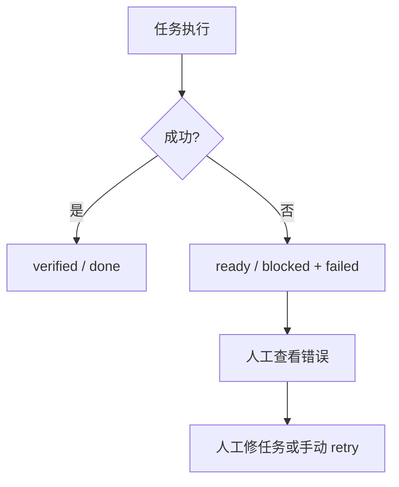
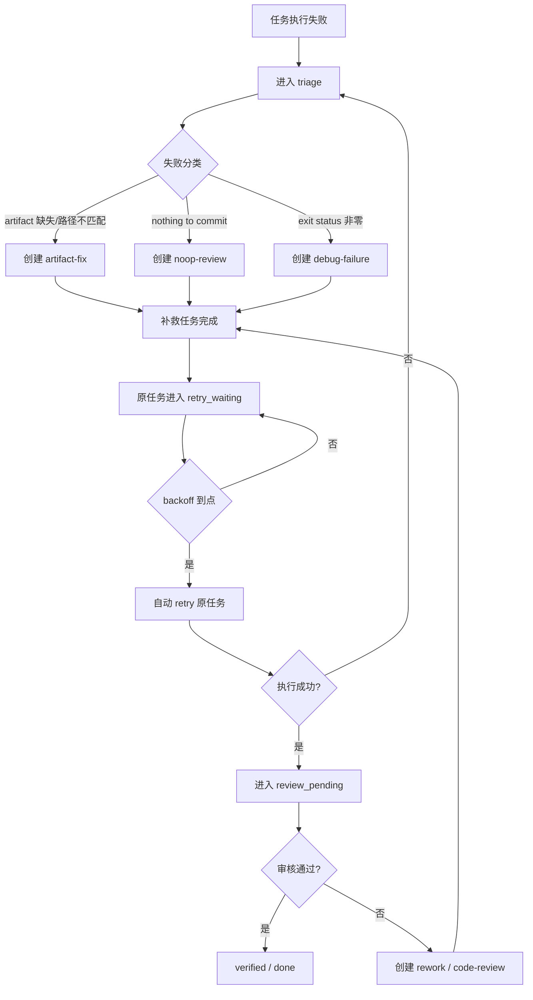

# PRD-DA-001｜动态协调与审核 Agent 系统

- 版本：PRD-DA-001
- 状态：implemented
- 所属项目：AI Orchestration Platform
- 目标版本：v2.x
- 日期：2026-04-10

## 1. 背景

当前平台已经具备：

- 自动派发
- 依赖等待
- 单 agent 限流
- 执行状态回写
- merge queue

但失败任务仍然会直接停住。

当前真实失败类型已经出现：

- `empty_artifact_match`
- `git command failed: ... nothing to commit, working tree clean`
- `command execution failed: exit status 1`

这些任务现在只会停在：

- `ready + failed`
- `blocked + failed`

依赖链也会因此卡住。

## 2. 目标

把平台从“自动执行器”升级成“自动协调器”。

目标是：

1. 任务失败后自动诊断，不直接停住。
2. 系统自动创建补救任务。
3. 系统自动选择合适的 agent 接手。
4. 补救完成后原任务自动重试。
5. 代码类任务增加独立审核关口。
6. 自动化全链路有止损，不会无限循环。

## 3. 非目标

本期不做：

1. 多模型自由对话编排。
2. 任意自学习策略。
3. 跨线程会话记忆。
4. 外部规则引擎。
5. 人工审批流。

## 4. 当前主流程

当前缺口是：

- 没有失败分类。
- 没有自动补救任务。
- 没有修复后自动 retry。
- 没有独立 review。

## 5. 目标流程

## 6. 角色设计

### 6.1 执行角色

- Claude
- Gemini
- Codex

### 6.2 系统角色

- Coordinator
- Reviewer

### 6.3 能力标记

每个角色都应具备能力声明：

- `can_execute`
- `can_triage`
- `can_review`
- `can_retry`
- `specialties`

### 6.4 第一版默认分工

- Claude
  - spec
  - no-op 判断
  - 分析型补救
- Gemini
  - UI
  - 前端修复
  - 内容型补救
- Codex
  - 代码修复
  - artifact 路径修复
  - debug
- Coordinator
  - 失败分诊
  - 自动分单
- Reviewer
  - 审核
  - 返工判定

## 7. 状态设计

### 7.1 新增状态

- `triage`
- `review_pending`

### 7.2 复用状态

- `retry_waiting`
- `verified`
- `done`
- `blocked`

### 7.3 状态流转

- 执行失败：
  - `running -> triage`
- triage 完成：
  - 原任务 `triage -> retry_waiting`
- 执行成功：
  - `running -> review_pending`
- 审核通过：
  - `review_pending -> verified -> done`
- 审核拒绝：
  - `review_pending -> retry_waiting`
  - 或生成返工任务

## 8. 失败分类

### 8.1 第一版错误码

- `artifact_missing`
- `artifact_spec_mismatch`
- `git_no_changes`
- `command_exit_nonzero`
- `workspace_write_failed`
- `dependency_failed`
- `non_retryable_failure`

### 8.2 规则

1. `empty_artifact_match`
   - 输出路径配置明显错误：`artifact_spec_mismatch`
   - 输出路径合理但未生成：`artifact_missing`

2. `nothing to commit, working tree clean`
   - `git_no_changes`

3. `command execution failed: exit status N`
   - `command_exit_nonzero`

4. 依赖传播失败
   - `dependency_failed`

## 9. 系统任务类型

新增系统任务类型：

- `triage-failure`
- `artifact-fix`
- `debug-failure`
- `noop-review`
- `code-review`
- `rework`

这些任务由平台自动创建。

## 10. 自动协作规则

### 10.1 失败到补救

- `artifact_*`
  - 创建 `artifact-fix`
  - owner：`Codex`

- `git_no_changes`
  - 创建 `noop-review`
  - owner：`Claude`

- `command_exit_nonzero`
  - 创建 `debug-failure`
  - owner：`Codex`

### 10.2 代码审核

- 代码任务执行成功后：
  - `review_pending`
  - 创建 `code-review`
  - owner：`Reviewer`

- 文档或分析任务成功后：
  - 也进入 `review_pending`
  - 但 review 规则更轻

### 10.3 修复后重试

- 补救任务 `done`
- 原任务进入 `retry_waiting`
- backoff 到点后自动 retry

## 11. 止损规则

必须防止平台无限自转。

第一版硬规则：

1. 同一原任务最多自动派生 2 个补救任务。
2. 同一 `failure_signature` 不重复派生。
3. 原任务最多自动重试 3 次。
4. 超限直接进入 `blocked`。

## 12. 数据模型

### 12.1 任务新增字段

- `parent_task_id`
- `root_task_id`
- `derived_from_failure`
- `coordination_stage`
- `review_decision`
- `failure_code`
- `failure_signature`
- `auto_repair_count`
- `last_review_task_id`

### 12.2 事件新增字段

- `event_subtype`
- `error_code`
- `error_signature`
- `agent_role`

### 12.3 角色配置

- `agent_id`
- `agent_role`
- `capabilities`
- `priority`
- `enabled`

## 13. API 需求

### 13.1 新接口

- `GET /api/v1/projects/{project}/scheduler/tasks/{id}/lineage`
- `GET /api/v1/projects/{project}/scheduler/failure-policies`
- `PATCH /api/v1/projects/{project}/scheduler/failure-policies`
- `GET /api/v1/projects/{project}/scheduler/agents`
- `PATCH /api/v1/projects/{project}/scheduler/agents/{id}`
- `POST /api/v1/projects/{project}/scheduler/tasks/{id}/triage`

### 13.2 现有接口增强

现有 execution / task / board 接口要补：

- `failure_code`
- `failure_signature`
- `coordination_stage`
- `review_decision`
- `parent_task_id`
- `root_task_id`

## 14. 看板需求

### 14.1 必须新增

1. 结构化失败原因显示
2. 任务链路显示
3. 系统角色显示
4. 自动化阶段显示

### 14.2 看板上要能看见

- 原任务
- 补救任务
- 审核任务
- 当前阶段
- 下一步动作
- 是否会自动重试

## 15. 用户故事

### US-01 失败任务自动进入协调流程

作为平台操作者，希望任务失败后系统自己判断怎么处理，而不是停在看板上等人点。

验收标准：

- 任务失败后 30 秒内进入 `triage`
- 自动创建补救任务或审核任务
- 看板能看到原任务与派生任务关系

### US-02 平台自动选择合适的修复 agent

作为平台操作者，希望不同类型的问题由不同 agent 处理。

验收标准：

- artifact 问题优先给 `Codex`
- no-op 问题优先给 `Claude`
- UI 问题优先给 `Gemini`

### US-03 修复完成后原任务自动重试

作为平台操作者，希望补救任务完成后原任务自动恢复执行，不需要手动点 Retry。

验收标准：

- 原任务进入 `retry_waiting`
- backoff 到点自动重试
- 原任务和补救任务有明确关联

### US-04 代码任务有独立审核关口

作为平台操作者，希望任务执行成功后不是立刻 done，而是先审。

验收标准：

- 代码任务成功后进入 `review_pending`
- 审核通过才 `verified/done`
- 审核失败会派生返工任务

### US-05 自动化有止损

作为平台操作者，希望系统失败时不会无限派生任务。

验收标准：

- 同一原任务自动补救次数有限
- 同一错误签名不重复派生
- 超限后直接 `blocked`

## 16. 首批实战样本

本期必须覆盖当前真实失败任务：

- `TS-BF5C2847`
- `TS-A5A59E27`
- `TS-77F7A1C4`
- `TS-27A52716`

这些任务要作为第一轮回归样本。

## 17. 验收总标准

以下 7 条全部满足才算完成：

1. 任一失败任务 30 秒内自动进入 triage。
2. 系统会自动生成正确的补救任务。
3. 补救任务完成后原任务自动 retry。
4. 代码任务成功后进入 review，而不是直接 done。
5. 系统不会无限重试或无限派生。
6. 依赖链会在前置恢复后继续推进。
7. 看板能展示完整链路和当前阶段。
