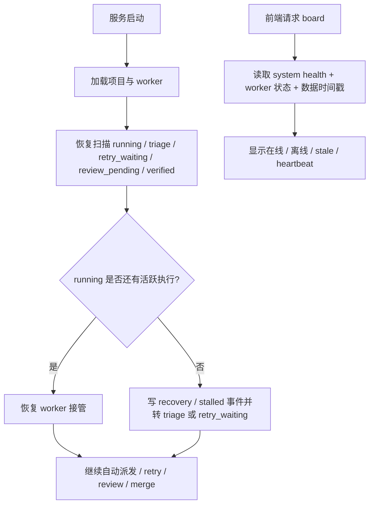

# PRD-OPS-001｜平台运行稳定性与恢复

- 版本：PRD-OPS-001
- 状态：proposed
- 所属项目：AI Orchestration Platform
- 目标版本：v2.1
- 日期：2026-04-11
- 依赖：`docs/prd/PRD-DA-001-dynamic-coordinator-reviewer.md`

## 1. 背景

平台已经具备：

- 多项目调度
- auto dispatch
- failure orchestration
- retry worker
- review worker
- merge queue

当前阻塞不在任务谱系，也不在失败分类规则。
当前阻塞在运行态：

- 正式看板仍依赖单独的前端进程。
- `8080` 停止后，所有 worker 一起停。
- 服务重启后，旧的 `running / triage / retry_waiting / review_pending` 任务恢复不完整。
- `running` 任务缺少 heartbeat 和 timeout，容易形成假运行态。
- 前端没有明确的后端离线、worker 停止、数据陈旧提示。

## 2. 目标

把平台从“开发态双进程 + 人工判断是否卡死”，改成“单进程正式看板 + 启动恢复 + 心跳超时回收 + 健康提示”。

目标是：

1. 正式看板只依赖 `8080`。
2. 服务重启后，旧任务会自动恢复推进。
3. 假 `running` 会被自动识别并回收。
4. 前端能明确提示后端离线和数据陈旧。
5. 不破坏现有多项目、triage、retry、review 主链。

## 3. 非目标

本期不做：

1. 新的调度 DSL。
2. 新的存储引擎。
3. 全量实时日志系统。
4. 新的多模型协商协议。
5. 业务项目仓库改造。

## 4. 用户故事

### US-01 正式看板不依赖开发服务器

作为平台操作者，希望只起一个正式服务就能打开看板，而不是依赖 `5173`。

验收：

- 只启动 `8080`
- `http://127.0.0.1:8080/board` 可访问
- API 和看板共享同一服务进程

### US-02 服务重启后旧任务自动恢复

作为平台操作者，希望服务被重启后，旧任务不会永远停在旧状态。

验收：

- `running` 任务在重启后 30 秒内被重新接管或纠偏
- `triage / retry_waiting / review_pending` 任务会重新进入 worker 扫描
- 不需要人工点击才能继续

### US-03 假 running 会自动回收

作为平台操作者，希望没有真实执行的 running 任务不会一直挂在看板上。

验收：

- 超时没有 heartbeat 的 execution 会自动记为 stalled
- 对应任务会自动转 `triage` 或 `retry_waiting`
- 会写恢复或僵尸回收事件

### US-04 前端能提示后端和数据健康状态

作为平台操作者，希望看板能直接告诉我后端是不是还活着、数据是不是旧的。

验收：

- 前端显示后端在线 / 离线
- 前端显示 worker 状态
- 前端显示数据更新时间与陈旧时间
- running 任务显示最后心跳时间

## 5. 目标流程

## 6. 范围

### 6.1 后端

- Go 静态托管 `web/dist`
- SPA 路由回退
- startup recovery runner
- execution reaper
- heartbeat / timeout 字段与事件
- system health / worker status 接口

### 6.2 前端

- 正式入口改用 `8080/board`
- 健康状态展示
- stale-data 提示
- running 任务 heartbeat 展示

### 6.3 文档

- README
- `.planning/STATE.md`
- `.planning/codebase/STACK.md`
- `docs/project-api-contract.md`
- 本 PRD 对应 plan

## 7. 新增字段与接口

### 7.1 execution 字段

- `started_at`
- `last_heartbeat_at`
- `timeout_at`
- `stalled`

### 7.2 系统接口

- `GET /api/v1/system/health`
- `GET /api/v1/system/workers`

### 7.3 系统事件

- `recovered_running_task`
- `execution_stalled`
- `worker_offline`

## 8. 约束

- 不改业务项目仓库。
- 不破坏现有项目化 API。
- 不把正式看板继续建立在 `npm run dev` 上。
- 每个 PR 必须同步更新文档。没有文档更新的 PR，不算完成。

## 9. 总验收标准

以下 5 条全部满足才算完成：

1. 只启动 `8080` 就能打开看板。
2. 服务重启后，旧任务会自动恢复推进。
3. 假 `running` 会被自动回收。
4. 前端能提示后端离线和数据陈旧。
5. 不再依赖 `5173 dev server` 才能看进度。
