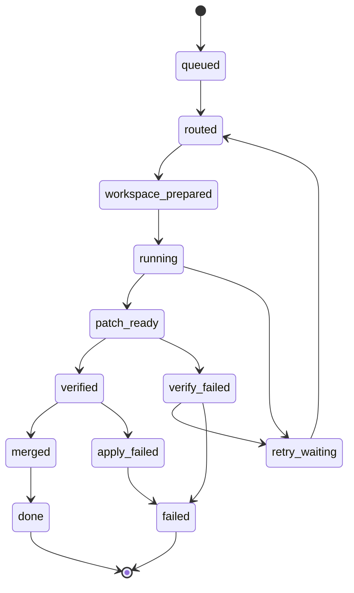

# 多终端 AI 编排平台 PRD v24

## Summary
- v1 是单人、本地优先的多 AI 编排平台。GSD 是首个 Connector，不是平台内核。
- 状态存储用 SQLite。`tasks` 是状态真源，`events` 是审计与恢复辅助。
- CLI transport 用 git worktree。API transport 用普通隔离目录。
- 合并固定为“工件复制到主 checkout + `git add` + `git commit`”。
- `conflicts_with` 只对 sealed wave 生效。增量计算只作为内部实现优化。
- 逆向专项任务必须跑可量化闭环，直到静态还原结果与真机 Frida 黑盒结果 Diff 一致率达到 100%。

## Core Model
### 1. 标识与来源
- `dispatch_ref` 是编排器为一次派发批次生成的内部标识。
- `dispatch_ref` 由平台在处理一次 `discoverTasks()` 调用开始时自动生成。
- 同一次 `discoverTasks()` 调用返回的所有任务共享同一个 `dispatch_ref`。
- `dispatch_ref` 由平台写入标准化后的 Task Card，并在需要时返回给 Connector 用于后续关联。
- `dispatch_ref` 只用于平台内部分组、路由、wave 管理和恢复。
- `source_ref` 是来源系统原始标识，由 Connector 保留上游语义。
- 两者关系：
  - `dispatch_ref` = 平台内部批次 ID
  - `source_ref` = 外部来源 ID
- 格式约束：
  - `task_id` 只允许 `[a-z0-9_-]`，长度 1 到 16
  - `dispatch_ref` 只允许 `[a-z0-9_-]`，长度 1 到 32

### 2. Task Card
- 最小字段：
  - `id`
  - `dispatch_ref`
  - `source`
  - `source_ref`
  - `type`
  - `objective`
  - `context`
  - `files_to_read`
  - `files_to_modify`
  - `acceptance_criteria`
  - `relations`
  - `wave`
  - `priority`
- `files_to_modify` 是 v1 写入白名单，支持 glob。
- GSD 来源的新文件路径由 Connector 补全。
- 手动/API 来源的新文件路径由操作者补全。
- 若新文件路径未提前声明，编排器不会自动抽取。

### 3. SQLite 持久化
- `tasks` 表至少包含：
  - `id`
  - `dispatch_ref`
  - `state`
  - `retry_count`
  - `loop_iteration_count`
  - `transport`
  - `wave`
  - `topo_rank`
  - `workspace_path`
  - `artifact_path`
  - `last_error_reason`
  - `created_at`
  - `updated_at`
  - `terminal_at`
  - `card_json`
- `events` 表至少包含：
  - `event_id`
  - `task_id`
  - `event_type`
  - `from_state`
  - `to_state`
  - `timestamp`
  - `reason`
  - `attempt`
  - `transport`
  - `runner_id`
  - `details`
- `waves` 表至少包含：
  - `dispatch_ref`
  - `wave`
  - `sealed_at`
  - `created_at`
- `(dispatch_ref, wave)` 唯一。
- `card_json TEXT NOT NULL` 保存完整 Task Card JSON。
- 路由、冲突计算、验收、恢复时的业务字段默认从 `card_json` 读取。

### 4. Wave 一致性规则
- 任务入队时，平台自动 upsert 对应的 `(dispatch_ref, wave)` 到 `waves` 表。
- `sealed_at = null` 表示该 wave 未 seal。
- `tasks.wave` 必须始终对应一条同 `(dispatch_ref, wave)` 的 `waves` 记录。
- 任务可以先进入 `queued`，但在对应 wave `sealed_at` 非空之前不得进入 `routed`。
- Connector 必须以 `(dispatch_ref, wave)` 为单位一次性提交整 wave 任务，或显式调用 `sealWave(dispatch_ref, wave)` 后才允许该 wave 进入路由。
- 已 seal 的 wave 不允许追加任务。追加请求直接拒绝，`reason = "wave_already_sealed"`。

### 5. 依赖与冲突
- `relations[]` 中每条边包含：
  - `task_id`
  - `type`
  - `reason`
- `type` 仅允许：
  - `depends_on`
  - `conflicts_with`
- `depends_on` 只能由 Connector 或操作者显式声明。
- `conflicts_with` 只在同 wave 内计算。
- 若两任务间已存在 `depends_on`，Router 不再生成 `conflicts_with`。
- `depends_on` 只能指向同 wave 或更早 wave。
- 指向更晚 wave 的依赖在入队时直接拒绝，`reason = "invalid_dependency"`。
- `topo_rank` 只基于 `depends_on` 计算。
- `wave` 不直接参与 `topo_rank`。
- 无依赖任务默认 `topo_rank = 0`。

## State And Execution
### 1. 状态机
- 主状态：
  - `queued`
  - `routed`
  - `workspace_prepared`
  - `running`
  - `patch_ready`
  - `verified`
  - `merged`
  - `done`
- 异常状态：
  - `retry_waiting`
  - `verify_failed`
  - `apply_failed`
  - `failed`

- `merged` 表示主 checkout 已成功提交。
- `merged -> done` 是即时转换，没有额外 finalize。
- `done` 和 `failed` 是唯一终态。
- TTL 从 `terminal_at` 起算，不依赖 `updated_at`。
- 终态任务拒绝所有迟到的外部状态写入；只记录警告，不改状态。
- 依赖失败传播由 Control Plane 立即触发。
- 当前仍在 `running` 的后置任务可被直接标记为 `failed`，`reason = "dependency_failed"`。
- v1 不强制中断底层执行进程。

### 2. Transport 归一化
- API transport：
  1. 返回完整文件工件
  2. 写入 `artifacts/{task_id}/`
  3. 同步写入 API 隔离目录
  4. 成功后进入 `patch_ready`
- API workspace 同步失败：
  - `running -> retry_waiting`
  - `reason = "workspace_write_failed"`
- CLI transport：
  1. 在 git worktree 修改
  2. 按 `files_to_modify` 白名单抽取
  3. 写入 `artifacts/{task_id}/`
  4. 成功后进入 `patch_ready`
- CLI 白名单匹配为空：
  - `running -> retry_waiting`
  - `reason = "empty_artifact_match"`
- 白名单外新增文件：
  - 只记录警告
  - 不抽取
  - 不单独判失败
- 从 `patch_ready` 开始，CLI 和 API 走同一条后续流程。

### 3. 合并队列
- 任务进入 `verified` 后立即加入全局合并队列。
- 合并队列单消费者串行处理。
- 不等待同 wave 其他任务全部 `verified`。
- 只消费依赖已全部 `done` 的 `verified` 任务。
- 排序固定为：
  - `topo_rank` 升序
  - `created_at` 升序
- `conflicts_with` 只影响路由与批次切分，不改变合并排序。

### 4. 重试与恢复
- `retry_count` 是任务级字段。
- 跨所有主动失败累计。
- 默认 `max_retries = 2`。
- 默认退避为 30 秒、60 秒。
- 退避从对应 `retry_waiting` 事件的 `timestamp` 起算。
- 恢复时复用原始时间戳，不重置计时。
- `attempt` 等于写事件时的当前 `retry_count`。
- 会消耗 `retry_count` 的原因码：
  - `execution_failure`
  - `workspace_write_failed`
  - `empty_artifact_match`
  - `deterministic_check_failed`
  - `test_command_failed`
  - `reverse_loop_exhausted`
  - `reverse_env_unavailable`
- 不消耗 `retry_count`：
  - `process_resume`
  - `dependency_failed`
- 恢复时必须重新触发一次依赖失败传播检查。

## Reverse Task Rules
### 1. 任务类型与命名
- 逆向专项任务类型统一使用 `reverse_` 前缀。
- v1 先支持：
  - `reverse_static_c_rebuild`

### 2. 逆向专项 Task Card 额外字段
- `context` 必须包含：
  - `target_so_path`
  - `ida_mcp_endpoint` 或等价 IDA MCP 标识
  - `frida_hook_spec`
  - `oracle_input_spec`
  - `oracle_output_ref`
  - `analysis_state_md_path`
  - `final_artifact_path`
- 缺少任一字段，任务不得进入 `routed`。
- `final_artifact_path` 是最终合并到项目中的 repo 相对路径。
- 运行过程中生成的最终代码工件固定写入：
  - `artifacts/{task_id}/reverse/final.c`

### 3. 逆向专项原则
- 不接受单次问答式产出。
- 只接受可量化循环。
- 结束条件只有一个：
  - 静态还原 C 代码编译后执行输出
  - 与真机 Frida 黑盒调用 Hook 输出
  - 标准化 Diff 后
  - `match_rate = 100%`
- 最终产物必须是独立可编译的 `.c` 文件。
- 必须包含所有依赖结构体定义。
- 不允许保留未解析偏移量。
- 每个逆向任务必须维护一个本地权威 `.md` 状态文件。
- 该文件不是日志，而是实时更新的知识库。
- 一旦旧假设被推翻，必须直接覆盖旧信息，不保留并列旧版本。
- 当检测到上下文截断、会话重置或恢复启动时，第一步必须读取这份 `.md` 再继续。

### 4. 逆向循环与外层状态边界
- `reverse_static_c_rebuild` 的主体循环发生在 `running` 状态内部。
- 固定循环：
  1. 通过 IDA Pro + ida-pro-mcp 获取静态信息
  2. 生成或修正静态还原 `.c`
  3. 编译 `.c`
  4. 按 `oracle_input_spec` 运行编译产物并采集 `static_output`
  5. 在真机上执行 Frida 黑盒调用并按 `frida_hook_spec` 采集 `frida_oracle_output`
  6. 做标准化 Diff
  7. 生成 `diff_report`
  8. 计算 `match_rate`
  9. 若 `match_rate < 100%`，继续下一轮循环
- 单步失败属于循环内自重试，不触发外层状态迁移，不消耗 `retry_count`：
  - `compile_failed`
  - `static_run_failed`
  - `frida_oracle_failed`
  - `diff_failed`
  - `oracle_mismatch`
- 这些内部失败通过 `events` 表记录：
  - `event_type = "loop_iteration"`
  - `from_state = "running"`
  - `to_state = "running"`
  - `reason` 使用具体原因码
- `oracle_mismatch` 表示本轮 `match_rate < 100%`，不是外层 `verify_failed`。
- 每完成一轮完整循环，`tasks.loop_iteration_count` 加 1。
- 只有两种情况才会触发外层 `running -> retry_waiting`：
  - `loop_iteration_count` 超过 `max_loop_iterations`
  - 出现不可恢复环境错误
- 对应原因码：
  - `reverse_loop_exhausted`
  - `reverse_env_unavailable`
- 逆向专项任务默认 `max_loop_iterations = 50`，可配置。
- 外层进入 `retry_waiting` 后，下一次重新执行时，`loop_iteration_count` 重置为 0。
- 每次外层重试都重新获得完整循环预算。
- 只有当循环内部达到 `match_rate = 100%` 且生成最终代码工件后，任务才允许 `running -> patch_ready`。

### 5. 逆向恢复规则
- 逆向任务在进程恢复时，如果当前外层状态仍为 `running`：
  - `loop_iteration_count` 保留当前值，不重置
  - 上一轮已生成的中间工件保留在 `artifacts/{task_id}/reverse/`
  - 这些中间工件不视为当前有效输入
  - 恢复后的循环必须从步骤 1 重新开始
- `analysis_state_md_path` 是唯一跨轮次、跨恢复的持久知识来源。
- 恢复时不得尝试从“编译已完成”或“Diff 已完成”的半步位置继续执行。
- 恢复后的第一步固定为：
  1. 读取 `analysis_state_md_path`
  2. 重新进入逆向循环第 1 步

### 6. 逆向专项工件与验收来源
- 逆向专项的机器验收工件必须全部写入 `artifacts/{task_id}/reverse/`：
  - `final.c`
  - `static_output.json`
  - `frida_oracle_output.json`
  - `diff_report.json`
- `diff_report.json` 必须包含：
  - `match_rate`
  - `mismatch_cases`
  - `normalization_rules`
- `analysis_state_md_path` 只保存人类可读的权威摘要。
- `analysis_state_md_path` 不是机器验收读取来源。
- 逆向专项验收读的是 `artifacts/{task_id}/reverse/` 下的机器工件。

### 7. 逆向专项验收
- 对普通任务，确定性验收包含：
  - 文件存在性
  - 路径合法性
  - 符号或 AST 简扫
  - 可选测试命令
- 对 `reverse_static_c_rebuild`，除上述外，额外强制要求：
  - 存在 `artifacts/{task_id}/reverse/final.c`
  - 存在 `static_output.json`
  - 存在 `frida_oracle_output.json`
  - 存在 `diff_report.json`
  - `diff_report.json.match_rate = 100`
  - `final.c` 可独立编译
  - `final.c` 包含所有依赖结构体定义
  - `final.c` 不含未解析偏移量
- 对逆向专项任务，`verify_failed -> retry_waiting` 只用于最终确定性验收失败。
- 原因码可为：
  - `deterministic_check_failed`
  - `test_command_failed`
  - `reverse_final_artifact_invalid`

### 8. Frida 与动态环境
- 平台不要求预先把 Frida 全部配好。
- 当逆向任务需要动态分析时，允许并要求代理自行完成：
  - Frida 安装
  - 注入脚本编写
  - 基础反调试绕过
- 这些动作属于任务执行的一部分。
- 若设备、Root、Frida 注入链路或 IDA MCP 不可用，并被判断为当前轮不可恢复，触发：
  - `running -> retry_waiting`
  - `reason = "reverse_env_unavailable"`

## Connector Interface
- Connector 负责：
  - `discoverTasks()`
  - `hydrateContext()`
  - `ackResult()`
  - `writeBackArtifacts()`
- 平台在处理一次 `discoverTasks()` 调用时自动生成 `dispatch_ref`。
- 同一次 `discoverTasks()` 返回的所有任务共享该 `dispatch_ref`。
- GSD Connector 额外负责：
  - 从 PLAN 生成 Task Card
  - 填充 `wave`
  - 填充显式 `depends_on`
  - 补全预期新文件路径到 `files_to_modify`
  - 在结果合并后回写 `SUMMARY/STATE/ROADMAP/VERIFICATION`

## Test Plan
- SQLite 事务一致性：事件写入和任务状态更新必须同事务完成。
- `dispatch_ref`：
  - 平台自动生成
  - 与 `source_ref` 语义分离
  - 一次 `discoverTasks()` 调用只生成一个 `dispatch_ref`
- `card_json` 恢复：进程重启后，路由、冲突计算、验收从 `card_json` 读取业务字段。
- `waves` 一致性：
  - 任务入队自动创建 `(dispatch_ref, wave)` 记录
  - `sealed_at = null` 时任务不得进入 `routed`
  - seal 后才能路由
  - seal 后追加任务被拒绝，`reason = "wave_already_sealed"`
- 依赖校验：
  - 指向更晚 wave 的依赖入队即拒绝，`reason = "invalid_dependency"`
- 冲突与依赖：
  - 已有 `depends_on` 的任务对不再生成 `conflicts_with`
  - 同 wave 冲突任务不得进入同一批次
- 终态保护：
  - `done/failed` 后迟到写入只记警告，不改状态
- 依赖失败传播：
  - 前置任务 `failed/apply_failed` 后，后置非终态任务立即进 `failed`，`reason = "dependency_failed"`
- Transport：
  - API workspace 同步失败 -> `retry_waiting`
  - CLI 空工件 -> `retry_waiting`
  - 白名单外新文件只记警告
- 普通验收：
  - 测试命令失败 -> `verify_failed -> retry_waiting`
- 合并：
  - 从工件目录复制到主 checkout 并提交
  - `apply_failed` 只能人工处理
- 排序：
  - `topo_rank` 固定
  - `created_at` 升序
  - 多 wave 无依赖任务默认 `topo_rank = 0`
- Windows：
  - 所有 transport 都检查根路径长度、空格、中文
  - CLI 额外检查符号链接权限和 worktree 路径长度
  - 纯 API 任务不依赖 worktree 权限
- 逆向专项：
  - 缺少 `analysis_state_md_path`、`frida_hook_spec`、`oracle_input_spec` 等字段时不得进入 `routed`
  - 每轮循环失败保持在 `running`
  - `compile_failed / static_run_failed / frida_oracle_failed / diff_failed / oracle_mismatch` 不得消耗 `retry_count`
  - `loop_iteration_count` 正确累加
  - 进程恢复后 `loop_iteration_count` 保留，不重置
  - 恢复后必须先读 `analysis_state_md_path`
  - 恢复后从循环第 1 步重新开始
  - `max_loop_iterations` 超限后进入 `retry_waiting`，`reason = "reverse_loop_exhausted"`
  - 外层重试重新执行时 `loop_iteration_count` 重置为 0
  - `diff_report.json.match_rate < 100` 时不得离开循环
  - 只有 `match_rate = 100` 才允许 `running -> patch_ready`
  - 最终 `final.c` 必须独立可编译，且不含未解析偏移量

## Assumptions And Defaults
| 项目 | 默认值 | v1 是否可配置 |
|---|---|---|
| 存储后端 | SQLite | 否 |
| API 工件格式 | 完整文件工件 | 否 |
| CLI 工件抽取 | `files_to_modify` 白名单 + glob | 否 |
| `task_id` 最大长度 | 16 | 否 |
| `dispatch_ref` 最大长度 | 32 | 否 |
| `max_retries` | 2 | 是 |
| 重试退避 | 30 秒 / 60 秒 | 是 |
| workspace / 工件 TTL | 72 小时 | 是 |
| git 提交作者 | `orchestrator-bot <orchestrator@local>` | 是 |
| `apply_failed` 自动重试 | 关闭 | 否 |
| 逆向专项 `max_loop_iterations` | 50 | 是 |

- v1 单用户、本地运行。
- `apply_failed` 在 v1 中必须人工处理。
- 跨 wave 顺序只靠显式 `depends_on` 保证，平台不按 wave 编号隐式排序。
- 同一 wave 的任务必须在 seal 前完整提交。
- 逆向专项任务类型统一使用 `reverse_` 前缀。
- `reverse_static_c_rebuild` 默认具备：
  - IDA Pro
  - ida-pro-mcp
  - 目标 `.so`
  - Root 安卓真机
  - 可用 Frida 注入条件
- 若逆向任务缺少真机 Frida 采集条件，则不得宣告完成。
